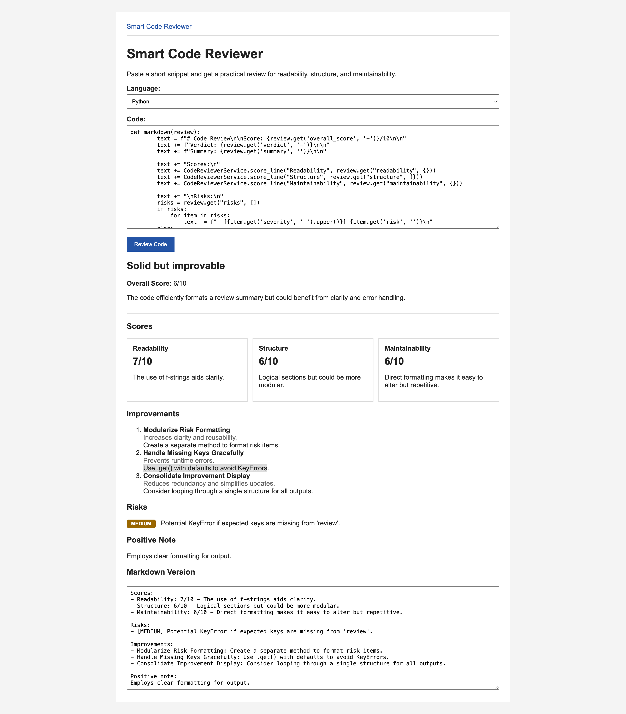

# Smart Code Reviewer

This is a simple Django app for Challenge 1: Smart Code Reviewer.

A user can paste a short code snippet, pick a language, and get a quick review focused on readability, structure, and maintainability before a human reviewer sees it.

## Features

- Code review form
- OpenAI API call
- Scores for readability, structure, and maintainability
- Severity-tagged risks
- Markdown text box for copying the result

## Local Setup

```bash
python3 -m venv .venv
source .venv/bin/activate
pip install -r requirements.txt
cp .env.example .env
```

Add your `OPENAI_API_KEY` in `.env`.

Run the app:

```bash
python manage.py runserver
```

Open `http://127.0.0.1:8000/`.

## Verification

```bash
python manage.py check
python manage.py test
```

## Screenshots



## 100-Word Summary

I built Smart Code Reviewer as a small Django prototype, even though my main experience is in Ruby on Rails. I picked Django deliberately as I wanted to stretch slightly outside my comfort zone while still leaning on backend concepts I already understand. The app reviews short code snippets for readability, structure, and maintainability before a human reviewer sees them. I kept the scope narrow on purpose: one form, one result, one clear piece of feedback. It was interesting seeing how much of my Rails intuition carried over to Django. It's a small project, but it reflects how I like to learn; by building.

## Notes

- If `OPENAI_API_KEY` is missing, the app shows a friendly error.
- Public dataset: not applicable. The app reviews user-provided or dummy code snippets.

